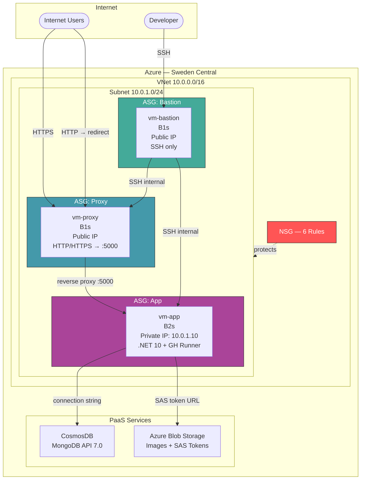
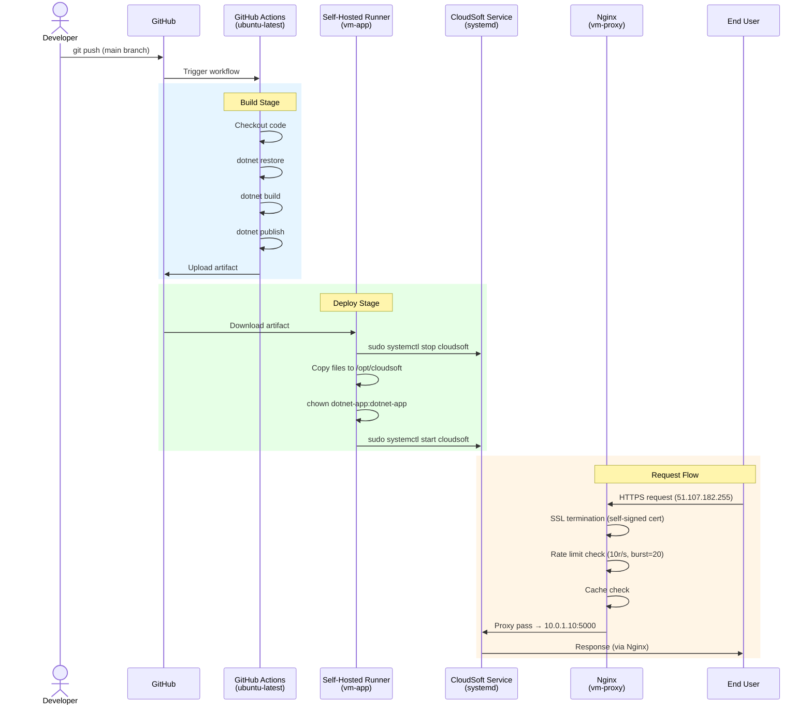

# CloudSoft — Assignment Report

## Architecture Overview

The CloudSoft Newsletter application is deployed on Azure using a three-VM architecture with PaaS backing services. The infrastructure follows a bastion pattern with strict network segmentation using NSG rules and Application Security Groups.

All resources are deployed to the **Sweden Central** region within a single VNet (`10.0.0.0/16`) and subnet (`10.0.1.0/24`).

## Application Lifecycle

The CI/CD pipeline uses GitHub Actions with a self-hosted runner installed on the application VM. On every push to the main branch, the application is built, published, and deployed automatically.

## Component Descriptions

### Bastion Host (vm-bastion)

Secure SSH jump box. Runs on a **B1s** VM with a public IP (`51.107.181.183`). The only VM with SSH exposed to the Internet. Used to access the proxy and application servers internally via SSH. No application workloads run on this machine — its sole purpose is secure administrative access to the other VMs in the VNet.

### Reverse Proxy (vm-proxy)

Nginx reverse proxy and SSL termination point. Runs on a **B1s** VM with a public IP (`51.107.182.255`). Accepts HTTP (redirects to HTTPS) and HTTPS traffic from the Internet. Uses a self-signed TLS certificate generated with OpenSSL, configured with the correct IP SAN for the public IP address. Implements rate limiting at 10 requests per second with a burst of 20 to prevent abuse. Proxy caching is enabled for improved performance. All valid traffic is forwarded to the application server at `10.0.1.10:5000`.

### Application Server (vm-app)

The ASP.NET Core MVC application host. Runs on a **B2s** VM with only a private IP (`10.0.1.10`) — no public IP is assigned. The CloudSoft.dll application runs as a systemd service under a dedicated `dotnet-app` system user (no shell, no login capability). This VM also hosts the GitHub Actions self-hosted runner, which enables automated deployments directly on the application server. The runner receives deployment jobs from GitHub and manages the service lifecycle (stop, copy, start).

### CosmosDB (MongoDB API)

Azure CosmosDB with MongoDB API (server version 7.0) stores subscriber data for the newsletter application. Configured with a shard key on `/email` and Session consistency level. The connection string is injected into the application via cloud-init, which writes it into the systemd service environment variables. This ensures secrets are never stored in application configuration files or source control.

### Azure Blob Storage

Stores the `hero.jpg` image used by the application. Configured with private access — no anonymous access is permitted. The application generates Shared Access Signature (SAS) token URLs with a 1-hour expiry window for secure, time-limited access to stored images. This approach ensures that image URLs cannot be shared or bookmarked for long-term unauthorized access.

## Security Measures

- **Bastion pattern:** Only the bastion VM has SSH exposed to the Internet. The proxy and application servers only accept SSH connections originating from the bastion host, enforced via ASG-based NSG rules. This limits the attack surface to a single, hardened entry point.

- **NSG with ASGs:** Six security rules using three Application Security Groups provide fine-grained access control. SSH is allowed to bastion only from the Internet. SSH to proxy and app is allowed only from the bastion ASG. HTTP/HTTPS is allowed only to the proxy ASG. Port 5000 is allowed only from the proxy ASG to the app ASG.

- **SSH key authentication:** Password authentication is disabled on all VMs. Only RSA key-based access is permitted, eliminating the risk of brute-force password attacks.

- **SSL/TLS termination:** A self-signed X.509 certificate is installed on the proxy with the correct IP Subject Alternative Name. All HTTP traffic is automatically redirected to HTTPS, ensuring encrypted communication between users and the proxy.

- **Rate limiting:** Nginx `limit_req_zone` is configured at 10 requests per second with a burst allowance of 20 requests. This protects the application from denial-of-service attacks and abusive request patterns.

- **No public IP on app:** The application server has no public IP address and is only reachable from within the VNet. External traffic must pass through the reverse proxy, which acts as the sole entry point for application requests.

- **SAS tokens:** Blob storage images are accessed via time-limited Shared Access Signature URLs with a 1-hour expiry. This prevents long-lived URLs from being shared or exploited for unauthorized access.

- **Least privilege:** The application runs as a dedicated `dotnet-app` system user with no shell and no login capability. This limits the blast radius if the application process is compromised.

## Provisioning (Bicep)

The entire infrastructure is defined as code in a single `main.bicep` file containing 19 Azure resources. Key techniques used in the Bicep template:

- **`loadTextContent()`** loads cloud-init YAML files from disk, keeping configuration management separate from infrastructure definitions.
- **`replace()` chains** substitute placeholders in the cloud-init YAML at deploy time, injecting runtime values such as connection strings, storage keys, and IP addresses without hardcoding secrets.
- **`listConnectionStrings()` and `listKeys()`** retrieve CosmosDB connection strings and storage account keys at deployment time, ensuring secrets are never stored in parameter files or source control.
- **`base64()`** encodes the final cloud-init content for the `customData` property on each VM.
- **Static private IP (`10.0.1.10`)** is assigned to the application server to avoid circular dependencies — the proxy's Nginx configuration needs to know the app's IP address at provisioning time.
- **`uniqueString(resourceGroup().id)`** generates globally unique names for PaaS resources (CosmosDB account, storage account) that require DNS-resolvable names.

## Configuration (Cloud-Init)

Three cloud-init YAML files handle post-provisioning configuration for each VM:

### cloud-init-bastion.yaml
Package updates and SSH hardening. Minimal configuration since the bastion host serves only as an SSH jump box.

### cloud-init-proxy.yaml
Installs Nginx and writes the full site configuration including reverse proxy rules, SSL/TLS setup, rate limiting (`limit_req_zone`), and proxy caching directives. Generates a self-signed certificate using `openssl` with the proper IP SAN for the proxy's public IP address. Enables and starts the Nginx service.

### cloud-init-app.yaml
Installs the .NET 10 runtime from Microsoft's package repository. Creates the `dotnet-app` system user (no shell, no login). Creates the systemd service unit for CloudSoft with environment variables containing the CosmosDB connection string and Blob Storage configuration. Installs and configures the GitHub Actions self-hosted runner, registering it with the repository using a runner registration token.

## Deployment (CI/CD Pipeline)

The deployment uses a two-stage GitHub Actions workflow triggered on pushes to the main branch:

### Stage 1 — Build (ubuntu-latest)
Runs on a GitHub-hosted runner:
1. Checkout source code
2. `dotnet restore` — restore NuGet packages
3. `dotnet build` — compile the application
4. `dotnet publish` — create a release-ready artifact
5. Upload the published artifact to GitHub Actions storage

### Stage 2 — Deploy (self-hosted)
Runs on the self-hosted runner installed on `vm-app`:
1. Download the build artifact from GitHub Actions storage
2. Stop the running service: `sudo systemctl stop cloudsoft`
3. Copy published files to `/opt/cloudsoft`
4. Set ownership: `chown dotnet-app:dotnet-app`
5. Start the service: `sudo systemctl start cloudsoft`

### One-Click Deployment Script
The `deploy.sh` script orchestrates the entire initial setup:
1. Create the GitHub repository
2. Push application code
3. Obtain a runner registration token
4. Deploy infrastructure via `az deployment group create` with the Bicep template
5. Upload the hero image to Blob Storage
6. Wait for cloud-init to complete on all VMs
7. Wait for the self-hosted runner to come online
8. Trigger the GitHub Actions workflow
9. Verify the deployment is successful

## Cloud Services

| Service | Purpose | Configuration |
|---------|---------|---------------|
| CosmosDB (MongoDB API) | Subscriber data storage | Server version 7.0, shard key `/email`, Session consistency |
| Azure Blob Storage | Hero image hosting | Private access, SAS token authentication, 1-hour expiry |
| GitHub Actions | CI/CD pipeline | Self-hosted runner on app VM, automatic deployment on push |

## Technology Stack

| Layer | Technology |
|-------|-----------|
| Application | ASP.NET Core MVC (.NET 10) |
| Database | Azure CosmosDB (MongoDB API 7.0) |
| Image Storage | Azure Blob Storage + SAS tokens |
| Web Server | Nginx 1.24 (reverse proxy) |
| SSL | Self-signed X.509 (OpenSSL) |
| OS | Ubuntu 24.04 LTS |
| IaC | Azure Bicep |
| Configuration | Cloud-Init |
| CI/CD | GitHub Actions |
| VM Sizes | B1s (bastion, proxy), B2s (app) |
| Region | Sweden Central |
